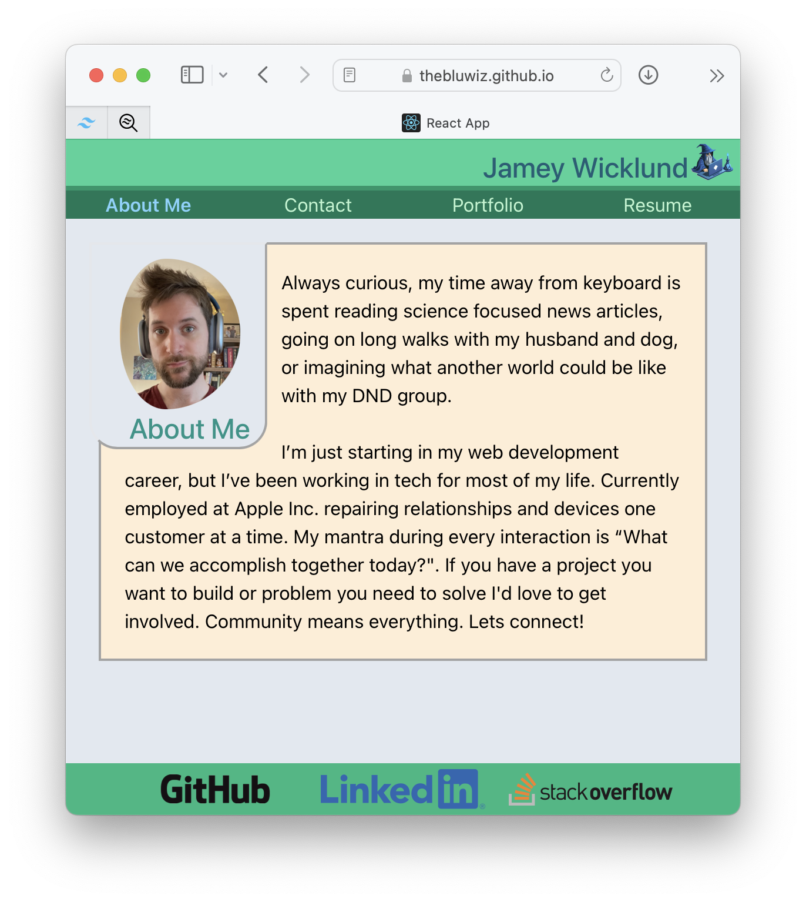

  # React Portfolio 
  ## Description
  This portfolio is my first React project. I intend to keep it updated as I build out new projects and expand my skill set and resume.
  ## Contact Me
  The contact form should be up and running shortly and will send me your messages directly. I'd love to hear about any projects you'd like help with and am also open to reccomendations on how to improve my code. I'll get back to you ASAP!
  ## Deployed Site
  You can check out my custom made portfolio [here](https://thebluwiz.github.io/react-portfolio/)!
  
  ## Future Development
  - I will be building out a server soon to handle the contact form submissions via nodemailer. When I do I will also update the URL for this site. 
  - The 'About Me' text needs a refresh now that I've nearly completed my Bootcamp.
  - My Resume needs to be updated to include my Development skills and certifications.
  - A service worker needs to be established to handle caching and improve load times.
  - Additionally, I want to expand the site to utilize Progressive Web App (PWA) technologies. I don't think anyone will need to install THIS site, but I think the technology is vastly under-utilized and I'd love to showcase its potential.
  ### Jamey Wicklund - theBluWiz
